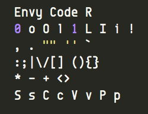

netj's Favorite Fonts
=====================

This directory and the Makefile lets you download some of netj's favorite
fonts for personal use.  Beware: some may have restrictions on using them
commercially or redistribution.

- [Envy Code R](http://damieng.com/blog/2008/05/26/envy-code-r-preview-7-coding-font-released)
    
    

- [Dijkstra](http://www.fonts101.com/fonts/view/Uncategorized/34398/Dijkstra.aspx)

- [Nanum Fonts](http://hangeul.naver.com/font) (Korean)
- [Nanum Gothic Coding Font](http://dev.naver.com/projects/nanumfont) (Korean)
- [Seoul Fonts](http://www.seoul.go.kr/v2012/seoul/symbol/font.html) (Korean)

- [Microsoft TrueType Core Fonts](http://corefonts.sourceforge.net/)

Run `make` to download and install them.

## Judging Quality of Coding Fonts
Characters that are commonly rendered ambiguously by many fonts not appropriate for coding:

    80oODQ@
    Il1|!ij
    `'":;.,~-_=#

And most of the ASCII characters:

    ABCDEFGHIJKLMNOPQRSTUVWXYZ
    abcdefghijklmnopqrstuvwxyz
    !@#$%^&*()_+-=,./?<>[]\{}|
    1234567890

Or some characters to look at side-by-side:

    a@ gqd hbp nm
    A4 T7J S5 9g
    []{}()<>

Here are some good readings regarding typefaces for programming:
* [Dan Benjamin's Top 10 Programming Fonts](http://hivelogic.com/articles/top-10-programming-fonts)
